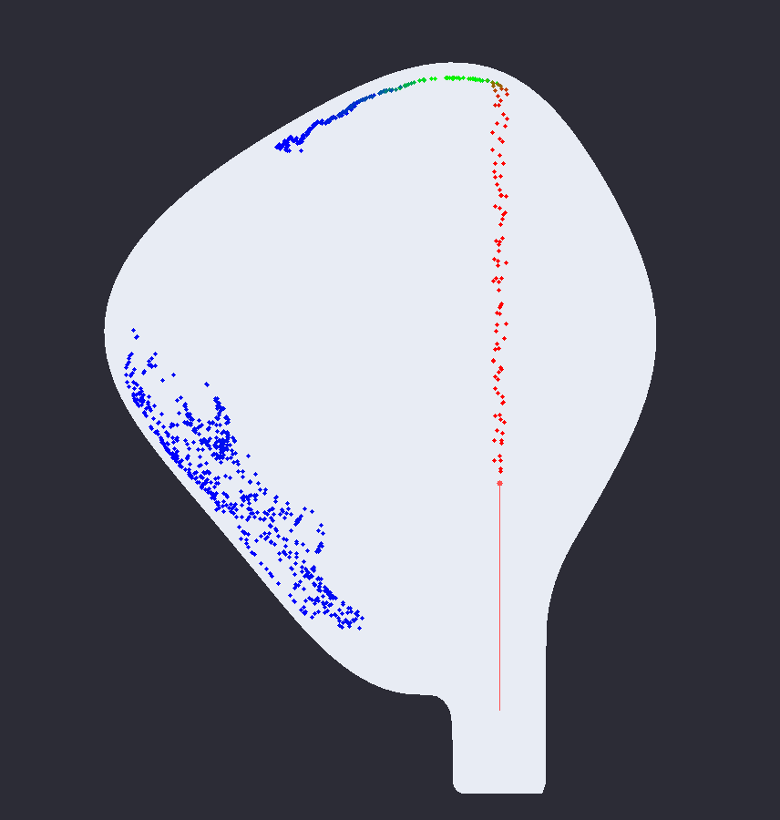
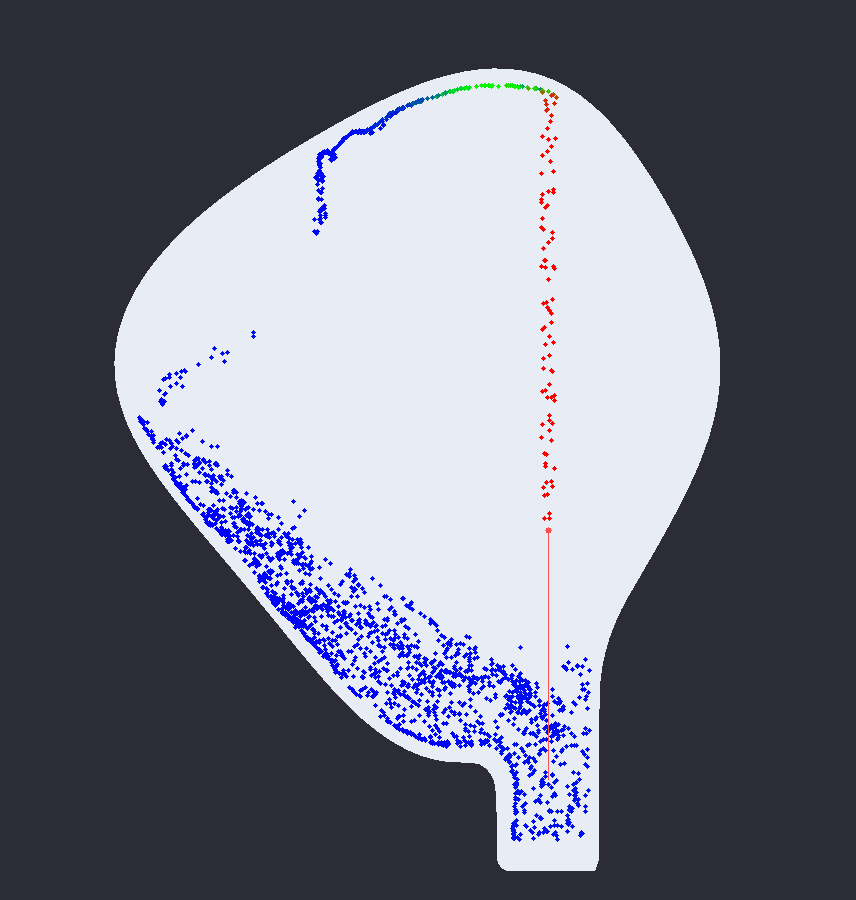
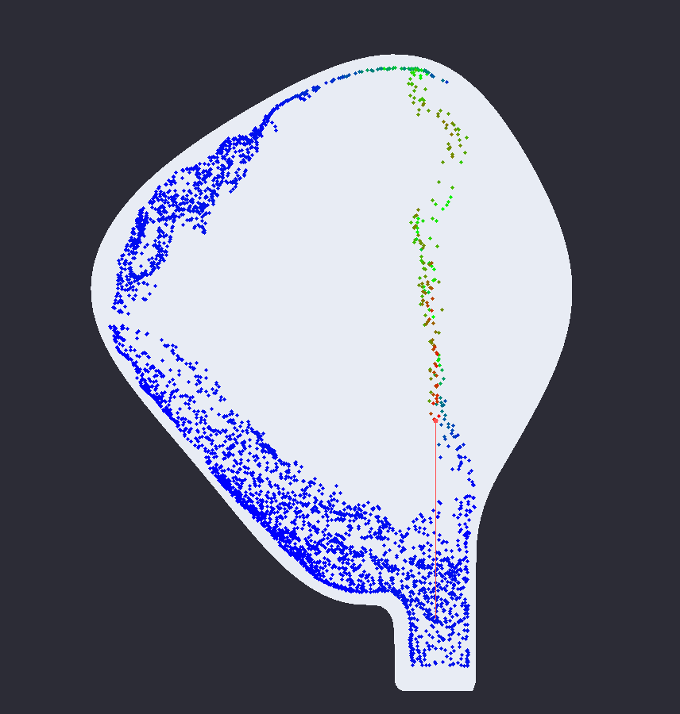
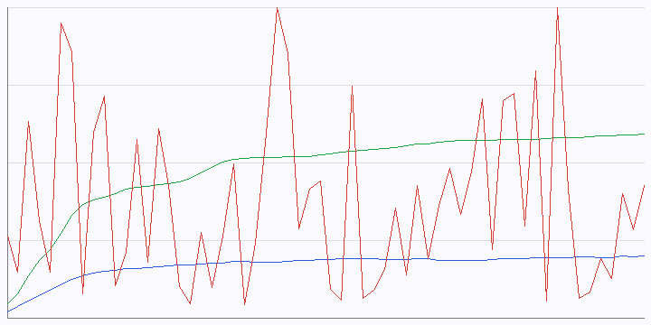

# sdr — maxillary-sinus irrigation simulator

A fast, reproducible **FLIP/PIC hydrodynamic solver** that models how irrigation
fluid fills, flushes and drains a maxillary sinus through an *oroantral
communication* — the socket left behind when an upper tooth is extracted.

It is the simulation stage of the thesis pipeline *“Development and hydrodynamic
modelling of a 3D model of the maxillary sinus for analysis of irrigation
through communication with the tooth socket.”* The solver emits particle clouds
that [`splashsurf`](https://github.com/InteractiveComputerGraphics/splashsurf)
turns into watertight meshes for rendering in Blender (Cycles):

```
DICOM CT ─▶ segmentation ─▶ mesh cleanup ─▶  sdr (this repo)  ─▶ splashsurf ─▶ Blender
 (Slicer)    (3D Slicer)     (Blender GN)     FLIP/PIC solve     Marching       Cycles
                                              + clinical metrics   Cubes         render
```

`sdr` owns the middle box. You can drive it parametrically (no patient data
needed) or feed it a watertight cavity mesh segmented from a real CT.

## What it looks like

A 2 s irrigation of the parametric sinus ([`examples/scene.toml`](examples/scene.toml)),
rendered straight from the solver. The needle (red line) enters through the
oroantral communication; particles are coloured by speed — the fast jet (red),
the lining wash (green at the roof), and the pooled/draining fluid (blue).

| jet enters the socket | cavity fills | lining fully washed |
| :---: | :---: | :---: |
|  |  |  |



*Clinical metrics over the run: wall-contact coverage (green) climbs to ~59 %
as the lining is washed; fill fraction (blue) plateaus near 20 % once inflow
balances drainage; focal membrane pressure (red) spikes where the jet impinges.
All four images are produced by `sdr simulate` itself — no external tooling.*

## Why it exists

CT slices don’t show a clinician how irrigant actually moves: where it pools,
how much of the lining it washes, how hard the jet presses on the mucous
membrane, or whether it drains back out through the socket. `sdr` answers those
questions with a physically-grounded simulation and reports them as clinical
numbers — in millimetres and millilitres, the units a doctor thinks in.

## Highlights

- **Real fluid dynamics.** Incompressible Navier–Stokes via a FLIP/PIC hybrid on
  a staggered MAC grid (Zhu & Bridson, *Animating Sand as a Fluid*, SIGGRAPH
  2005), with an MIC(0)-preconditioned conjugate-gradient pressure projection.
- **Correct physical scale.** You configure a sub-millimetre needle bore inside
  a ~3 cm cavity in clinical units; `sdr` converts to SI so the jet speed,
  pressures and volumes are physically meaningful.
- **Clinical metrics, not just pixels.** Fill fraction, wall-contact “wash”
  coverage, peak (focal) and mean (broad) membrane pressure load, drained
  volume, and a mass-balance check — written as JSON/CSV plus preview images.
- **Bit-for-bit reproducible.** Same input → byte-identical `summary.json`,
  every run. (Determinism is enforced by regression tests and in CI.)
- **splashsurf-native output.** Particle frames are written as `.vtk`/`.xyz`
  that `splashsurf` reads directly, so the solver → surface → Blender pipeline
  just works.
- **Self-validating CI.** The pipeline runs end-to-end on every change, behind
  clinical gates, and reconstructs a real surface mesh.

## Install

Needs a recent stable Rust toolchain.

```bash
git clone https://github.com/uselessgoddess/sdr
cd sdr
cargo build --release        # binary at target/release/sdr
```

For surface reconstruction, install splashsurf once:

```bash
cargo install splashsurf
```

## Quick start

```bash
# 1. Write an editable scene file (clinical units: mm, ml/s).
sdr init --output scene.toml

# 2. (optional) Export the cavity mesh for inspection / Blender import.
sdr generate-sinus --scene scene.toml --output sinus.obj

# 3. Run the irrigation simulation: particle frames + metrics + previews,
#    and reconstruct the final surface with splashsurf in one go.
sdr simulate --scene scene.toml --out-dir out --reconstruct

# 4. (or, later) reconstruct any saved frame on its own.
sdr surface --input out/frames/particles_000059.vtk --radius-mm 0.6
```

`sdr simulate` prints a clinical summary and fills `out/`:

```
out/
├── frames/        particle clouds per frame (.vtk for splashsurf)
├── preview/       rendered cavity cross-sections per frame (.png)
├── surface/       reconstructed final surface mesh (with --reconstruct)
├── metrics.json   per-frame metrics
├── metrics.csv    same, for spreadsheets/plots
├── metrics.png    time-series plot (fill / wash / pressure)
└── summary.json   headline numbers (see below)
```

Example summary (the `examples/scene.toml` run shown in the gallery above):

```
=== irrigation summary ===
peak fill fraction :   19.9 %
peak wall coverage :   59.1 %  (flushing effectiveness)
peak membrane load : 1099.3 mmHg (146558 Pa)  (focal jet impingement — over-pressure risk)
mean membrane load :    3.3 mmHg (436 Pa)  (typical broad load on the lining)
drained volume     :   8.11 ml  (of 10.0 ml injected)
mass balance       :  1.000  (1.0 = conserved)
```

## Configuring a scene

Everything is a small TOML file in clinical units. See
[`examples/scene.toml`](examples/scene.toml) for a fully annotated template and
[`examples/manual_needle.toml`](examples/manual_needle.toml) for hand-placing
the needle and tilting the patient’s head. The essentials:

```toml
[sinus]
# Parametric cavity, or load a patient mesh with:  mesh = "patient.obj"
semi_axes_mm = [17.0, 16.0, 13.0]   # half-axes of the sinus body
socket_xz_mm = [6.0, 0.0]           # where the extracted-tooth socket is
socket_radius_mm = 2.5

[needle]
auto = true            # auto-place at the socket, or set tip_mm = [x, y, z]
diameter_mm = 0.8      # inner bore (≈ 21G); with flow this sets the jet speed
flow_rate_ml_s = 5.0   # syringe push

[sim]
resolution_mm = 1.0    # grid spacing — the main speed/accuracy knob
duration_s = 2.0
frames = 60
```

Unknown keys are rejected, so a typo in a doctor’s config fails loudly instead
of silently defaulting.

### Placing the model and the needle (for clinicians)

1. **Geometry.** Either accept the parametric sinus and adjust `semi_axes_mm`,
   `taper`, `socket_xz_mm`, etc., or segment a real CT (3D Slicer → Blender),
   export a watertight `.obj`/`.stl` in millimetres, and set `[sinus].mesh`.
2. **Needle.** Set `auto = true` to drop the tip at the socket, or set
   `auto = false` and `tip_mm = [x, y, z]` to study a specific approach. `axis`
   aims the jet; `diameter_mm` + `flow_rate_ml_s` set how hard it pushes.
3. **Head position.** Tilt `[fluid].gravity_m_s2` to model supine vs. upright —
   it changes how the fluid pools and whether it drains back through the socket.

## What the metrics mean

| Metric | Meaning |
| --- | --- |
| **fill fraction** | share of cavity volume occupied by irrigant |
| **wall coverage** | fraction of the lining that fluid has touched — *flushing effectiveness* |
| **peak membrane load** | worst-case focal pressure where the jet impinges — the **over-pressure / barotrauma risk** |
| **mean membrane load** | typical broad pressure on the wetted lining |
| **drained volume** | irrigant that has left through the socket |
| **mass balance** | conservation check (1.0 = perfectly conserved) |

Pressures are reported in both Pa and mmHg. The peak load is physically capped
(jet stagnation pressure + hydrostatic head + margin); cells exceeding the cap
are counted as `membrane_artifacts` rather than inflating the figure, so the
reported peak is a defensible clinical number.

## Reproducibility

The solver is deterministic: a fixed-seed particle sampler, an order-stable
parallel dot-product in the CG solve, and order-stable metric reductions mean
the same scene produces a **byte-for-byte identical `summary.json`** on every
run. Two regression tests (`pressure_solve_is_bit_reproducible`,
`simulation_is_bit_reproducible`) and a dedicated CI step enforce this.

## Continuous integration

[`.github/workflows/ci.yml`](.github/workflows/ci.yml) runs four jobs on every
push and pull request:

- **lint** — `cargo fmt --check` and `clippy -D warnings`.
- **test** — the full suite in release mode (including the reproducibility and
  non-blank-render tests).
- **simulate** — the end-to-end pipeline behind clinical gates
  (`--min-fill`, `--min-coverage`), asserting every output exists and that
  re-running yields an identical summary; previews are uploaded as artifacts.
- **surface** — installs splashsurf and reconstructs the final frame, asserting
  a non-trivial watertight mesh.

## Project layout

| Module | Responsibility |
| --- | --- |
| `math`, `mesh` | vectors/AABBs; triangle-mesh IO (`.obj`/`.stl`) |
| `sinus`, `sdf` | parametric cavity model; signed-distance field |
| `surface_nets` | dual-contouring polygonizer for the cavity |
| `grid`, `particles` | staggered MAC grid; FLIP marker particles |
| `pressure` | MIC(0)-preconditioned CG pressure projection |
| `solver` | FLIP/PIC step, needle emitter, SDF boundaries, drainage |
| `scene` | doctor-facing TOML → ready-to-run solver (clinical units → SI) |
| `metrics` | clinical metrics + splashsurf-compatible particle output |
| `recon` | `splashsurf` reconstruction wrapper |
| `render` | software renderer: cavity slices + metric time-series |

## Method & references

The cavity is represented as a signed-distance field; fluid is carried by marker
particles transferred to/from a MAC grid each step (FLIP/PIC). Incompressibility
is enforced by a pressure-projection Poisson solve (preconditioned CG), giving a
true physical pressure field used for the membrane-load metrics. Particle clouds
are surfaced by splashsurf (SPH density + Marching Cubes) and rendered in Blender
Cycles.

1. Fedorov A. *et al.* **3D Slicer as an image computing platform.** *Magn Reson
   Imaging*, 2012.
2. **Blender Geometry Nodes** — blender.org.
3. Zhu Y., Bridson R. **Animating Sand as a Fluid.** *SIGGRAPH* 2005.
4. **splashsurf** — github.com/InteractiveComputerGraphics/splashsurf.
5. **Cycles Render Engine** — blender.org.

Pressure projection and preconditioning follow R. Bridson, *Fluid Simulation for
Computer Graphics*.

## License

Licensed under either of MIT or Apache-2.0 at your option.
